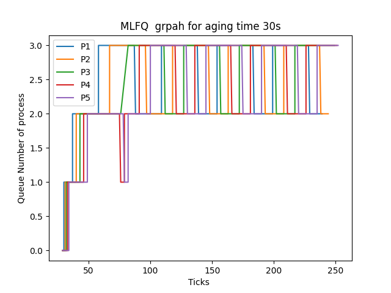

## FCFS Implementation
Selection of the Process

In your FCFS implementation within XV6, the focus is on selecting the process with the earliest creation time (ctime) among all the runnable processes. This choice aligns with the FCFS philosophy, where the process that has been waiting the longest is given priority.
Execution Without Yielding

Unlike some other scheduling algorithms that involve preemptive context switches (e.g., Round Robin), FCFS allows the selected process to run without yielding the CPU. This means that the process is allowed to execute until it completes its task or encounters a blocking operation (e.g., I/O).
Scheduling Next Process

Once the selected process completes its execution or blocks, the scheduler is called to determine the next process to run. In FCFS, this process selection is based on the next process with the lowest ctime. In essence, FCFS ensures that processes are executed in the order in which they arrive, promoting a first-in-first-out (FIFO) behavior.

avg running time : 24
avg wait time : 168

## MLFQ Implementation:

MLFQ in XV6 consists of four priority queues, numbered from 0 to 3. Queue 0 has the highest priority, and queue 3 has the lowest priority. Each queue is associated with a specific time slice for process execution, which becomes progressively longer for lower-priority queues:

    Priority 0: 1 timer tick
    Priority 1: 3 timer ticks
    Priority 2: 9 timer ticks
    Priority 3: 15 timer ticks

Process Execution Rules
Execution of Highest Priority Process

The scheduler always selects and runs the process from the highest-priority queue that is not empty. It does this by iterating through all the processes and finding the process with the lowest queue number and the earliest arrival time. If a process is already scheduled but has not used its full time slice, it continues running the highest-priority process using a context switch.
Preemption

Preemption occurs when a process in a lower-priority queue becomes ready, such as a process entering queue 0. In this case, the currently running process is preempted, changing its state from running to runnable. Preemption can only occur at the end of a 1-tick time slice.
Time Slice Exhaustion

If a process uses its complete time slice in its current priority queue, it is preempted and moved to the next lower-priority queue. This operation resets the process's wait time and tick count.
CPU Relinquishment

A process may voluntarily relinquish control of the CPU, typically due to I/O operations. When such a process becomes ready again, it is inserted at the tail of the same queue from which it was relinquished earlier.
Wait Time

Wait time is a crucial metric in MLFQ. It is increased for all runnable processes at every CPU tick. Wait time is used to determine when a process should be promoted to a higher-priority queue or demoted to a lower-priority queue.
Aging

To prevent process starvation, the MLFQ scheduler implements an aging mechanism. If a process in a priority queue other than priority 0 exceeds a predefined wait time limit, its priority is increased, and it is moved to the next higher-priority queue. The wait time is reset to 0 whenever a process gets selected by the scheduler or if a queue change occurs due to aging. This mechanism ensures that processes that have been waiting for an extended period are given higher priority, preventing them from being stuck in lower-priority queues.
avg running time : 22
avg wait time : 189

## RR Implementation:
Time Slicing

The core idea of RR is to allocate a fixed time slice to each process. In XV6, this time slice is typically set to 1 timer tick, although it can be adjusted based on system requirements.
Process Execution Rules

The RR scheduler in XV6 follows these process execution rules:
Yielding the CPU

On every timer tick, an interrupt is raised. In the context of RR, this interrupt is used to yield the CPU voluntarily. When a process yields the CPU, it effectively gives up control of the CPU and moves to a runnable state. This behavior is achieved by calling the yield() function.
Preemption

After a process uses its entire time slice (e.g., 1 timer tick), it is preempted by the scheduler. This preemption ensures that each process receives a fair share of CPU time. The preempted process is moved to the end of the queue of runnable processes, and the next process in the queue is selected to run.
Process Queue

The RR scheduler maintains a queue of runnable processes. When a process is created or becomes runnable, it is added to the end of the queue. The scheduler selects processes for execution from the front of the queue.

avg running time : 25
avg wait time : 192

## Here's how the average wait times stack up:

- *FCFS* has the lowest average waiting time , suggesting that processes spend less time in the queue before being executed.
- *RR* has a slightly greater average waiting time  than FCFS, meaning that processes wait longer in the queue before being able to execute.
- *MLFQ* has a waiting time similar to RR, implying a similar average waiting time.

## Final Thoughts:

- *FCFS* outperforms in terms of average waiting time, providing the shortest wait time for processes.
- The average waiting times for *RR* and *MLFQ* are comparable, with RR having a little longer average waiting time.

## graph for mlfq:

References - CHATGPT, stackoverflow,computerscience stack overflow, geeksforgeeks
